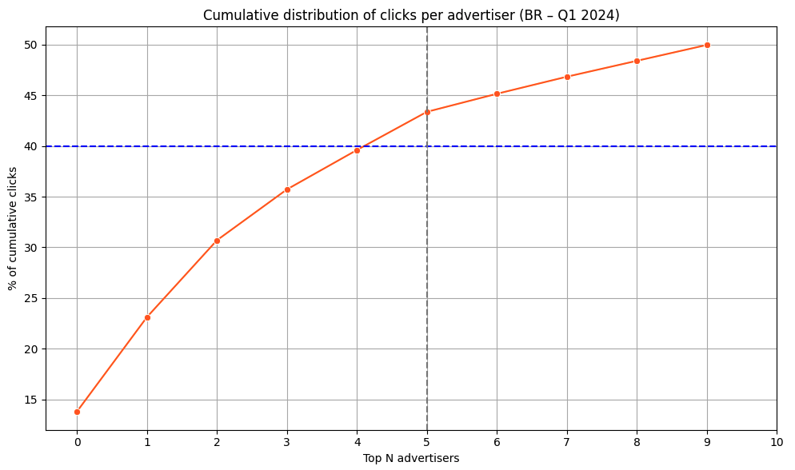
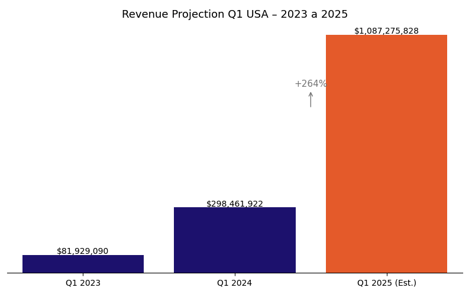

# Criteo Analytics Case Study 2025

This project is an analytical solution for the Criteo case study, with the aim of generating strategic insights from simulated digital campaign data.

## 🎯 Objectives

- To assess the exposure of the Brazilian market to its main advertisers.
- Analyze the impact of year-end sales on the fashion sector.
- Estimate Q1 2025 revenue for US advertisers.
- Provide strategic recommendations based on the data analyzed.
- Explore additional insights through complementary analysis.

## 🧾 Data Structure

| Column           | Description |
|------------------|-------------|
| Year             | Campaign year |
| Month            | Campaign month |
| Country          | Country of advertiser |
| Advertiser_ID    | Unique identifier of the advertiser |
| Industry         | Industry of advertiser |
| Clicks           | Clicks on ads |
| Displays         | Ad impressions |
| Client_Sales     | Sales generated for the client |
| Client_Revenue   | Revenue generated for the client |

## 🇧🇷 Concentration of Clicks in Brazil (2024)

How many advertisers are responsible for 40% of clicks in Brazil?

- Strategy: cumulative sum of clicks per advertiser ordered in descending order.
- Result: **5 advertisers** account for 40% of clicks in 2024.

| Advertiser_ID | Cumulative clicks % |
|:-:|:-:|
| A9 | 13.82 |
| A24 | 23.13 |
| A13 | 30.70 |
| A33 | 35.71 |
| A5 | 39.60 |
| A22 | 43.36 |
| A99 | 45.14 |
| A75 | 46.82 |
| A139 | 48.39|
| A151 | 49.95 |

## 👗 Seasonal Impact: Fashion in France

User behavior in the fashion industry during the end-of-year period (November and December).

| Metric | Jan-Oct (average) | Nov-Dec (average) | Variation (%) |
|-|-:|-:|-:|
| Clicks | 15,465.19 | 17,355.28 | +12.22% |
| Displays | 3,787,375.21 | 3,552,459.70 | -6.20% |
| Client_Sales | 320.72 | 366.55 | +14.29% |
| Client_Revenue | 25,476.96 | 46,567.11 | +82.78% |

$$
\text{Variation (\%)} = \left( \frac{\text{Holiday Avg} - \text{Before Avg}}{\text{Before Avg}} \right) \times 100
$$

## 🇺🇸 Estimated Revenue Q1 2025 - US

As the data for 2025 is not available, I used the data for 2023 and 2024 for the projection.

- Revenue Q1 2023: **US$ 81,929,089.52**
- Revenue Q1 2024: **US$ 298,461,921.57**
- Annual growth: **+264.29%**
- **Estimate Q1 2025:** **US$ 1,087,275,827.81**
  
$$
\text{Growth Rate} = \left( \frac{\text{Q1 2024} - \text{Q1 2023}}{\text{Q1 2023}} \right) \times 100
$$

$$
\text{Q1 2025 Est.} = \text{Q1\_2024} \times (1 + \text{Growth Rate})
$$

## 📈 Advanced Analysis

### ✔️ Campaign efficiency by Advertiser (BR)
- Cálculo de CTR, CPC e CPA por anunciante

### 🌍 Top Revenue by country and industry

| Country | Industry | Industry_Revenue	|Total_Revenue_by_Country |	Percent |
| - | -: | -: | -: | -: |
| US | AUTOMOBILE / MOTO / BOATING | 596,372,055.65 | 1,427,777,297.12 | 41.77 |
| FR | REAL ESTATE | 358,910,782.30 | 1,119,818,654.50 | 32.05 |
| JP | TRAVEL | 207,887,315.78 | 354,035,987.77 | 58.72 |
| DE | FASHION / LUXURY | 134,671,582.57 | 397,887,676.04 | 33.85 |
| GB | TRAVEL | 129,095,404.93 | 496,625,694.51 | 25.99 |
| BR | FASHION / LUXURY | 63,804,384.77 | 192,178,725.62 | 33.20 |

## 🧠 Conclusions & Recommendations

- The click base in Brazil is concentrated in a few advertisers → diversification is key.
- Fashion in France is highly seasonal → prioritize personalized campaigns in November/December.
- USA has consistent growth in Q1 → reinforce campaigns at seasonal events.
- Clustering can be used for targeted strategies by advertiser profile.

## 🛠️ Technologies used

  

## 👩🏻‍💻 Author

## 🔓 License

